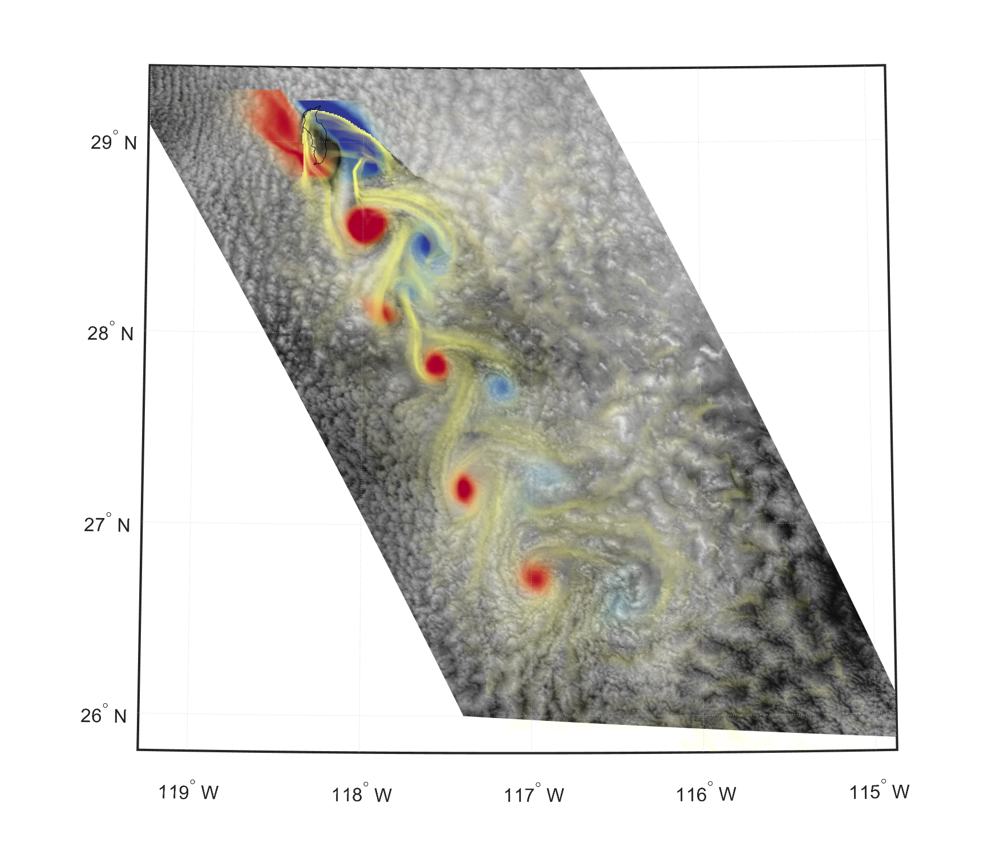

# Installation Guidelines

This Matlab program contains the code to generate the images of the paper:

Lagrangian Coherent Structures and Vortex Formation in High Spatiotemporal-Resolution Satellite Winds of an Atmospheric Kármán Vortex Street, 
T. Günther, A. Horváth, W. Bresky, J. Daniels, and S.A. Buehler

## Requirements
- Matlab (tested on Matlab 2021a)
- Matlab Mapping Toolbox (for plotting of the Guadalupe data)
- C++ compiler (tested on Windows with MSVC and MinGW)

## Setup Mex (C++ binding for Matlab)
The majority of the code is implemented in C++ in the file vislcs.hpp. Each routine of this class has a Matlab wrapper in the /cpp folder. This code has to be compiled before it becomes useable in Matlab.
- if you have not configured a C++ compiler for your Matlab instance before, uncomment line 2 of 'install.m' or directly call 'mex -setup C++' in the Matlab console.
- run the script 'install.m' in the Matlab console to compile the C++ files
The wrapped routines are all contained in the Matlab class 'flow.m'.

## Data
The data is too large to be stored on GitHub. Please download the files and copy the *.nc files into the /data folder:
- [cylinder2d.nc](https://faubox.rrze.uni-erlangen.de/getlink/fiViiRSdE3oBiKsiztW43Um5/cylinder2d.nc)
- [guadalupe.nc](https://faubox.rrze.uni-erlangen.de/getlink/fi7eHJHSYZshGWZZfNYQB3wW/guadalupe.nc)

## Creating figures
Each figure is implemented in a separate script. You can either run scripts individually, or:
- run all scripts by calling 'run_experiments.m'. This might take a few minutes.
